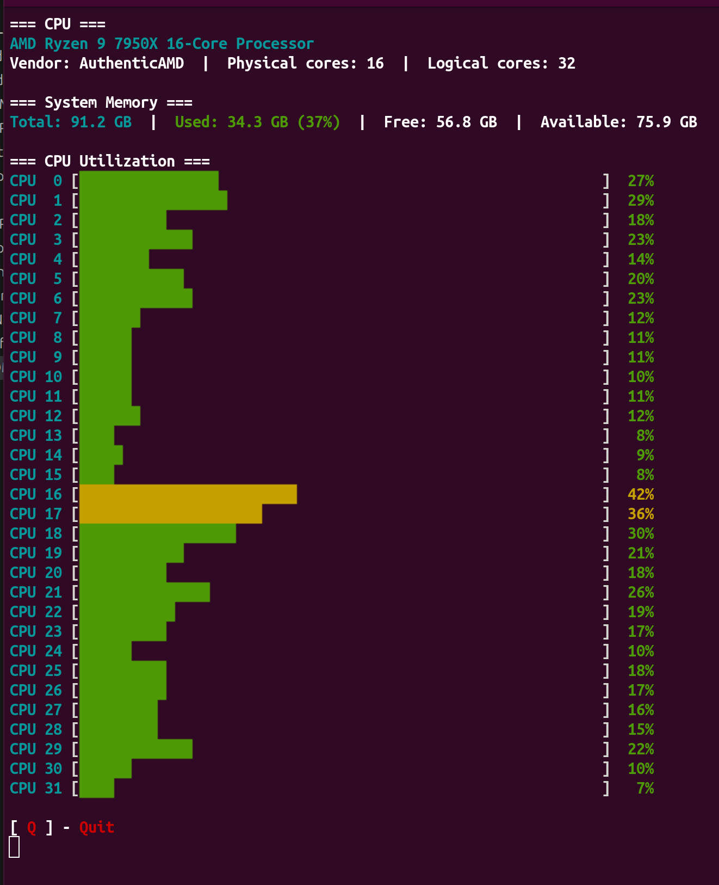

# cpu-graph-cli

A simple and lightweight CLI monitoring tool for CPU and system memory.

## In Use



## Dependencies

CPU and memory data is read directly from `/proc/stat` and `/proc/meminfo` — no external tools required at runtime.

The only build dependency is [g-lib](https://github.com/pgalasti/g-lib), which must be built and installed before building this project.

### 1. Fetch, build, and install g-lib

```bash
git clone git@github.com:pgalasti/g-lib.git
cd g-lib
make
sudo make install
```

This installs the shared library to `/usr/local/lib/libg-lib.so` and the headers to `/usr/local/include/g-lib/`.

### 2. Clone this project

```bash
git clone git@github.com:pgalasti/cpu-graph-cli.git
cd cpu-graph-cli
```

## Make

### Build

Builds binary file.

```bash
make
```

### Clean

Removes built binary.

```bash
make clean
```

### Install

Installs to `~/tools/` directory.

```bash
make install
```
